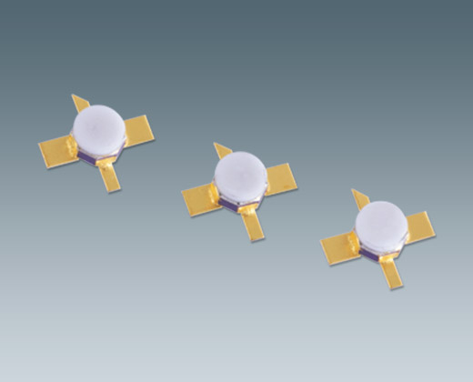
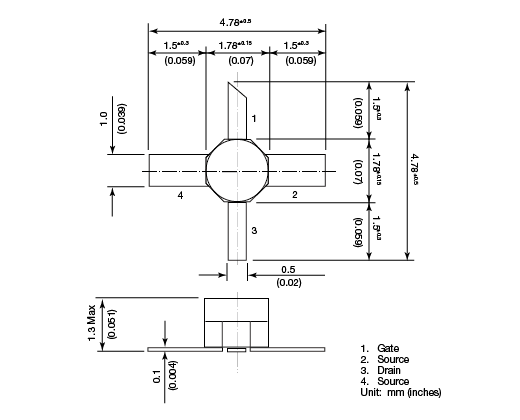

# Low Noise Amplifier Design

  

[Source.](https://shop.kuhne-electronic.com/kuhne/en/shop/industrial/prof-power-amplifier/prof-l-band/KU+LNA+152+AH++Super+Low+Noise+Amplifier/?card=354)

In EHB451E, we learned about Active Microwave Circuits; mostly amplifiers and oscilators.

This is a term project from EHB451E, where we designed a low noise amplifier and simulated &amp; compared to real world applications.

The [pdf file](https://github.com/kantarcise/Low-Noise-Amplifier-Design/blob/master/040130091-Term_Project.pdf) contains the report. For curve fitting and data enrichment of S parameters, the small matlab script can be found [here](https://github.com/kantarcise/Low-Noise-Amplifier-Design/blob/master/Enrich_data.m). General calculations for the gain and the noise figure can be made with the script [here](https://github.com/kantarcise/Low-Noise-Amplifier-Design/blob/master/Design%20Calculations.m).

Advanced Design System 2016 is used for simulation, and the transmission line parameters are iteratively calculated with the results.

It was a fun project =)

## Introduction

A low-noise amplifier (LNA) is an amplifier that is used to amplify signals with very low strength. Input signal of these amplifiers are 
very low – powered, barely recognizable, and they should be amplified without significant degrade on signal to noise ratio. Otherwise 
important information might be lost. LNA’s are one of the most important circuit components present in signal receivers.

Our goal is to design an LNA that is adequate on quality with the real world applications; with the knowladge we gathered during the 
course.

Well, to make an amplifier, there are lots of ways; but we chose the transistor and a matching circuit route. For that, we needed to 
chose an transistor, that is actually commercialized as low noise, so we could use it in an LNA. 

For the transistor, we chose this beautiful looking masterpiece called "FHX76LP". ([Source](https://www.sedi.co.jp/file.jsp?/pdf/FHX76LP_ED1-3.pdf))

  
  

## Design

After the selection of "FHX76LP" we obviously needed the S parameters of it; for differing frequencies. In the official datasheet, S parameters are only given at 1 GHz strides. This is not ideal for a real world application case, so we needed to enrich the data.

That is where the [data enrichment](https://github.com/kantarcise/Low-Noise-Amplifier-Design/blob/master/Enrich_data.m) comes in to play. 

You thought there would not be any matlab in this huh. Well, allow me to introduce you **"Curve Fitting"**.

  

The matlab code given is to increase the number of S parameters, with a pretty basic idea. And even though it's just interpolating, the results were pretty accurate; as it's checked in simulation.

After we get almost the 10 times bigger data for S parameters, we can do a design on any frequency desired. (This is actually pretty important, as if you are trying to reproduce this project with another transistor; you might want to take a look at the matlab script.)

After you chose the S parameters for your frequency, its time to move on to the stability check. You can take a look on how we calculate determinant and the K value from the report.

If the amplifier is stable at the frequency; for a low noise design, we might want to take a look at the **"Noise Parameters"** .

These 3 parameters that is crucial can be given as *"Minimum Noise Figure, Optimum reflection coefficient and Resistance Value"*

In a low noise amplifier design, with the used transistor; we know the values for a low noise transistor. In fact, the noise paramters can be found in the datasheet for "FHX76LP".

## Simulation

After completing the design; we move on to the simulation, to evaluate our calculations for our low noise amplifier. 

Advanced Design System 2016 is the software of choice for this project. However; any electronic design automation software could've been used. With it's simplicity and accessibility; **"ADS 2016"** is just a nice choice.

The calculated transmission line lenghts were a bit off, so we used sweep tuning.

Trial and error comes into play at this point. *Tune Parameters* were used to fine tune lenghts, and with different choices, the results were observed with simulation.

## Results & Future Work

## Help, I'm Stuck!

For any questions regarding on how to open the code and play around matlab, feel free to contact [Sezai](mailto:sezaiburakkantarci@gmail.com) from the mail. 
