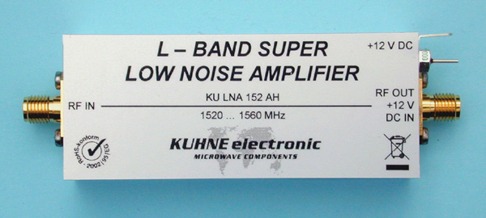

# Low Noise Amplifier Design

  

[Source.](https://shop.kuhne-electronic.com/kuhne/en/shop/industrial/prof-power-amplifier/prof-l-band/KU+LNA+152+AH++Super+Low+Noise+Amplifier/?card=354)

In EHB451E, we learned about Active Microwave Circuits; mostly amplifiers and oscilators.

This is a term project from EHB451E, where we designed a low noise amplifier and simulated &amp; compared to real world applications.

The [pdf file](https://github.com/kantarcise/Low-Noise-Amplifier-Design/blob/master/040130091-Term_Project.pdf) contains the report. For curve fitting and data enrichment of S parameters, the small matlab script can be found [here](https://github.com/kantarcise/Low-Noise-Amplifier-Design/blob/master/Enrich_data.m). General calculations for the gain and the noise figure can be made with the script [here](https://github.com/kantarcise/Low-Noise-Amplifier-Design/blob/master/Design%20Calculations.m).

Advanced Design System 2016 is used for simulation, and the transmission line parameters are iteratively calculated with the results.

It was a fun project =)

## Introduction

A low-noise amplifier (LNA) is an amplifier that is used to amplify signals with very low strength, usually from an antenna [2]. Input 
signal of these amplifiers are very low – powered, barely recognizable, and they should be amplified without significant degrade on 
signal to noise ratio. Otherwise important information might be lost. LNA’s are one of the most important circuit components present in 
signal receivers.

## Design

## Simulation

## Results & Future Work

## Help, I'm Stuck!

For any questions regarding on how to open the code and play around matlab, feel free to contact [Sezai](mailto:sezaiburakkantarci@gmail.com) from the mail. 
